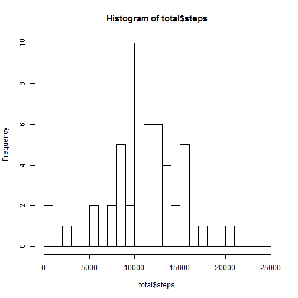
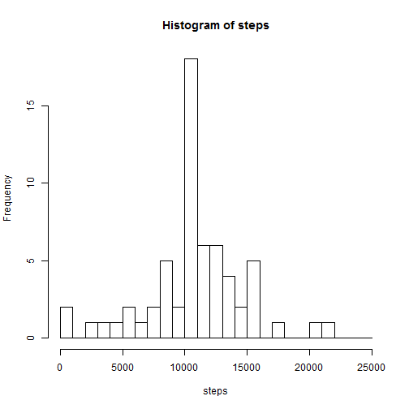
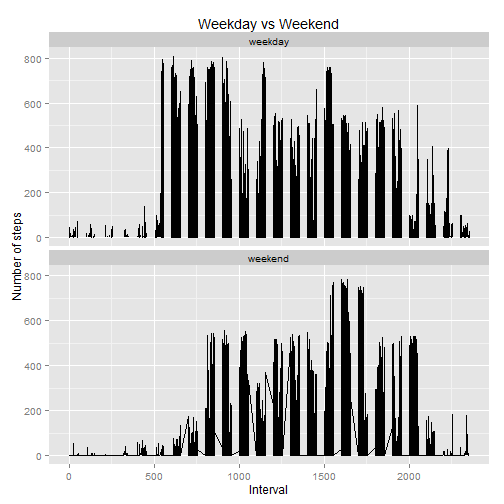

#Load Data


```r
library(ggplot2)
```

```
## Warning: package 'ggplot2' was built under R version 3.1.3
```

```
## Need help? Try the ggplot2 mailing list: http://groups.google.com/group/ggplot2.
```

```r
setwd("C:/Users/jamshz/Documents/R/activity")
activity <-read.csv("activity.csv")
```

#Number of steps taken


```r
total<-aggregate(steps ~ date, data = activity, sum, na.rm = TRUE)
head(total)
```

```
##         date steps
## 1 2012-10-02   126
## 2 2012-10-03 11352
## 3 2012-10-04 12116
## 4 2012-10-05 13294
## 5 2012-10-06 15420
## 6 2012-10-07 11015
```

#Histogram of steps taken


```r
hist(total$steps, breaks = seq(0,25000,1000))
```

 

#Averages of Steps Taken


```r
med.total <- median(total$steps)
mean.total <- mean(total$steps)
```

The mean number of steps taken is 1.0766189 &times; 10<sup>4</sup> and the medial number of steps taken is 10765.

#Steps by Interval


```r
TSP <- aggregate(steps ~ interval, data = activity, mean, na.rm=TRUE)
with(TSP, plot(interval, steps, type="l"))
```

 

#Max steps taken in Interval


```r
maxSteps <- max(TSP$steps)
maxTSPRow <- which(grepl(maxSteps, TSP$steps))
maxTSP <- TSP[maxTSPRow,1]
```
The maximum number of steps is 206.1698113. This was found in interval 835.

#Number of NAs

```r
sum(is.na(total$steps))
```

```
## [1] 0
```

#Inputing Missing Values
Using the medians at every 5 min, I replaced the values of NAs by the medians.


```r
activity2 <- activity
aggSteps <- aggregate(steps ~ interval, data = activity2, mean, na.rm=TRUE)

for (i in 1:length(activity2$steps)) {
if(is.na(activity2$steps[i])) {
index <- which(activity2$interval[i] == aggSteps$interval)
activity$steps[i] <- aggSteps$steps[index]
}
}
```

#Average of Steps Each Day

```r
total.imp <- aggregate(steps ~ date, data = activity, sum, na.rm = TRUE)
med.total2 <- median(total.imp$steps)
mean.total2 <- mean(total.imp$steps)
```

The mean number of steps taken with imputed values are 1.0766189 &times; 10<sup>4</sup>. The median number of steps taken with imputed values are 1.0766189 &times; 10<sup>4</sup>.

That compares to the original dataset's mean and median of 
1.0766189 &times; 10<sup>4</sup> and 10765 respectively.


#histogram of imputed dataset

```r
with(total.imp, hist(steps, breaks = seq(0,25000,1000)))
```

 

# Distinguishing weekend or weekday

```r
activity2['daytype'] <- weekdays(as.Date(activity2$date))
activity2$daytype[activity2$daytype == "Sunday"] <- "weekend"
activity2$daytype[activity2$daytype == "Saturday"] <- "weekend"
activity2$daytype[activity2$daytype != "weekend"] <- "weekday"
```

#Graph by weekend or weekday

```r
qplot(interval, steps, data = activity2, 
      type = 'l', 
      geom=c("line"),
      xlab = "Interval", 
      ylab = "Number of steps", 
      main = "Weekday vs Weekend") +
  facet_wrap(~ daytype, ncol=1)
```

```
## Warning: Removed 2 rows containing missing values (geom_path).
```

 
